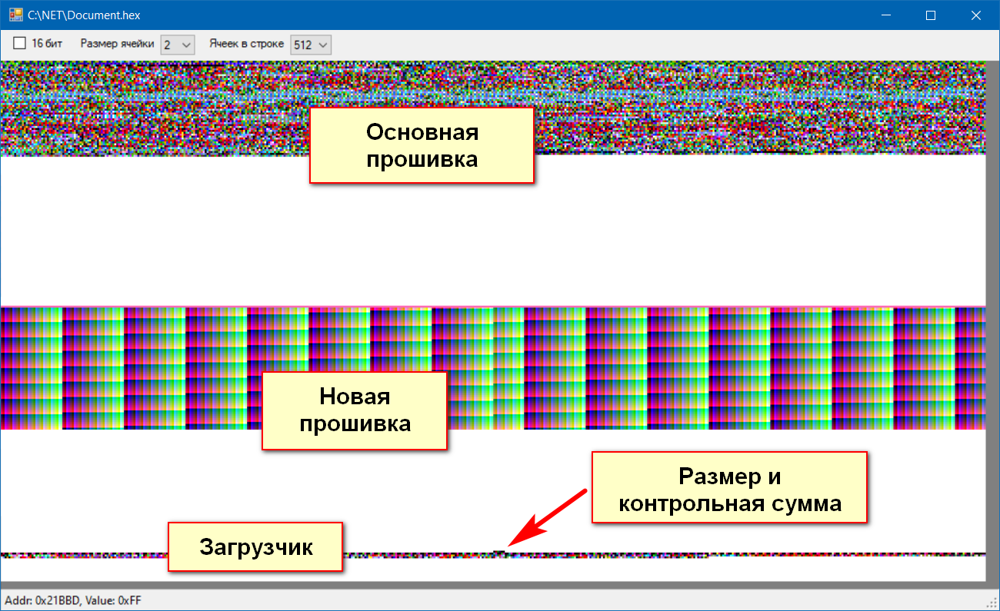

# Intel-hex-file visualizer

Application gets hex-file (or bin-file) of firmware and draw it with color rectangles.  
Every byte decodes like RGB8 or RGB16.   
  
Created for debugging the bootloader.  

# Визуализатор hex-файла

Приложение принимает hex-файл (формат intel HEX) прошивки и рисует квадратиками.   
Ячейка декодируется как RGB8 или RGB16.   
  
Создано для отладки загрузчика.  
  
